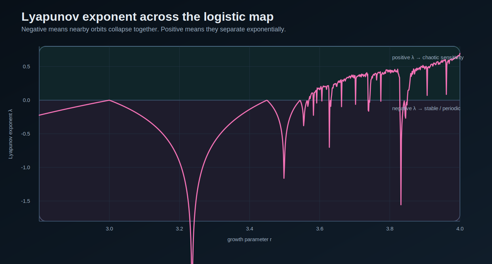
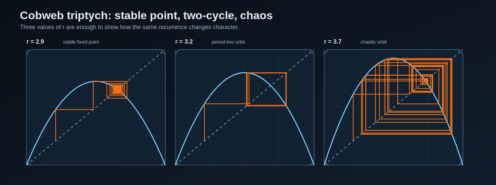
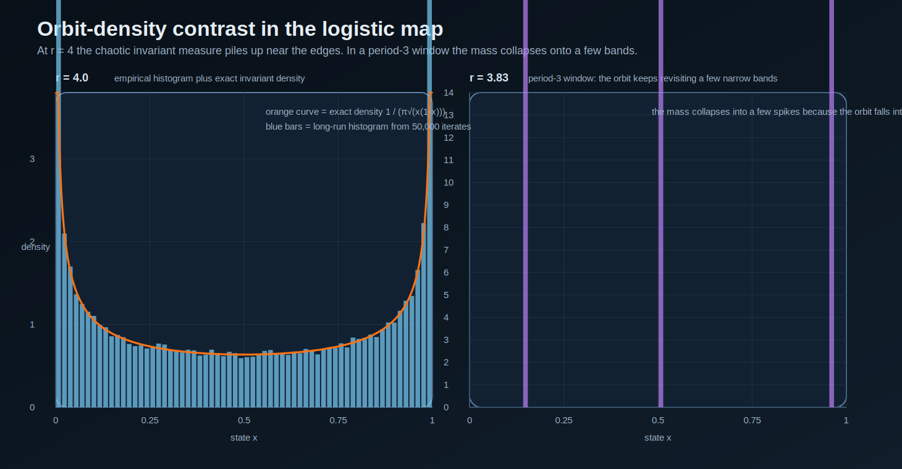
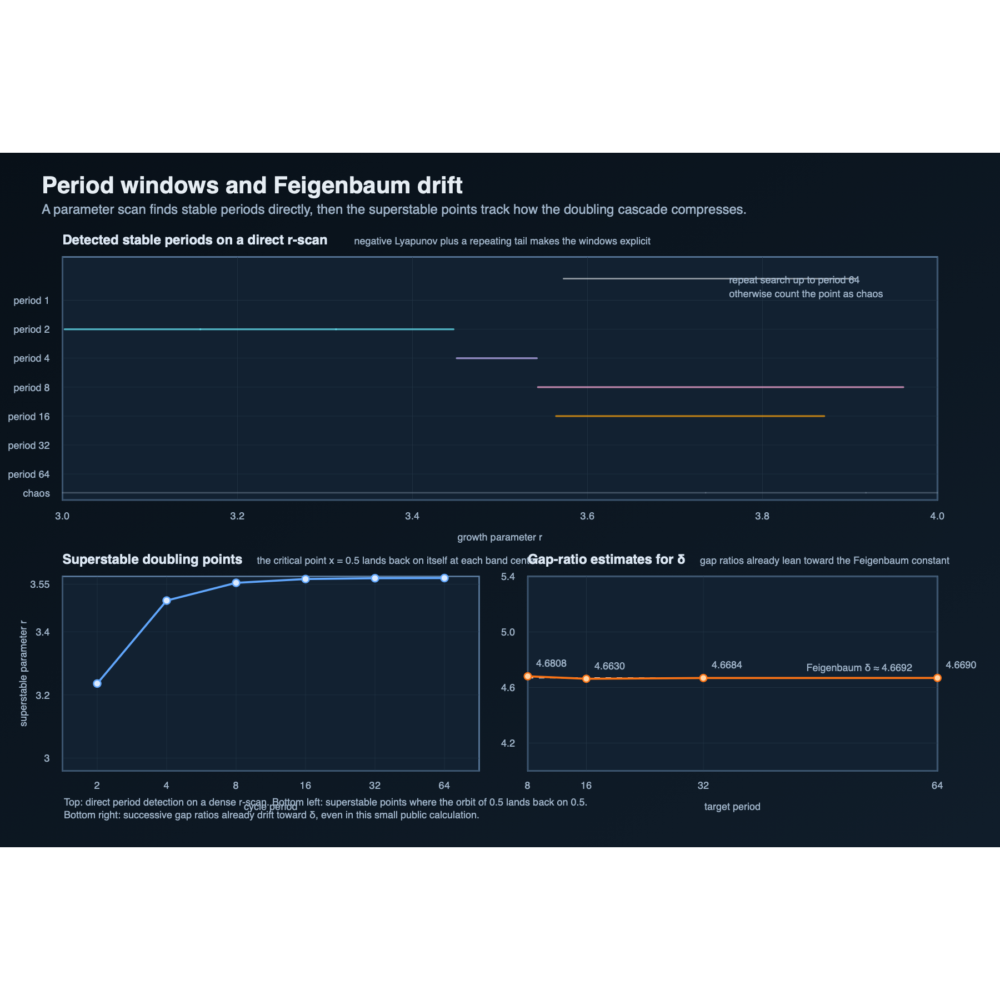
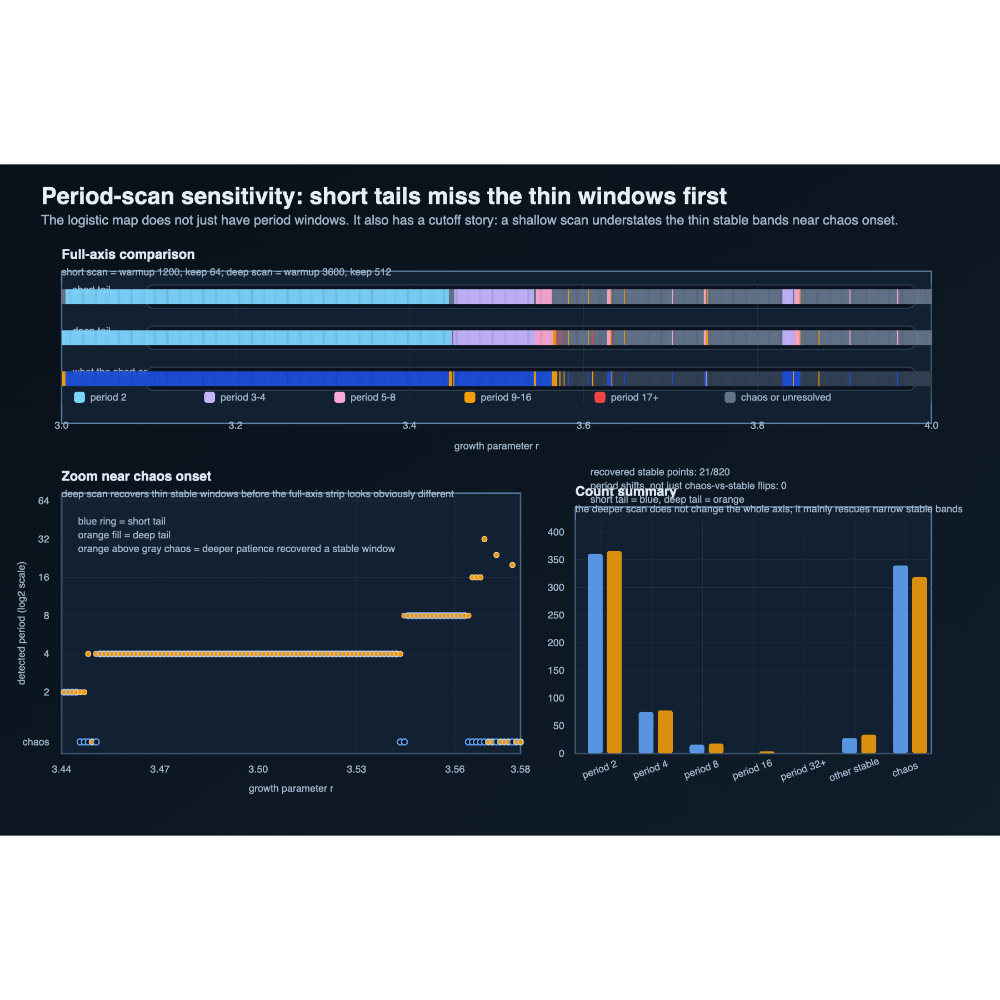

# Logistic Map Lab

A tiny recurrence with enough structure to teach fixed points, period doubling, Lyapunov exponents, and chaos without hand-waving.

This repo keeps the scope narrow on purpose:
- one system,
- pure Python,
- generated SVG figures,
- small tests that check the math stays honest.

## What is here

- `logisticlab/core.py`: iteration, long-run tail sampling, orbit-density histograms, Lyapunov exponent estimation, direct period detection, superstable-point scans, and period-scan comparisons
- `logisticlab/gallery.py`: figure generators for the bifurcation diagram, Lyapunov sweep, cobweb triptych, orbit-density contrast card, the period-doubling atlas, and a new period-sensitivity card
- `logisticlab/cli.py`: direct parameter classification, period scans, superstable reports, atlas rendering, and short-versus-deep scan comparison
- `scripts/generate_gallery.py`: one command to rebuild the assets plus both period reports
- `reports/period-doubling-and-feigenbaum.md` and `reports/period-scan-sensitivity.md`: generated notes that turn the scans into an actual teaching packet instead of a figure dump
- `notebooks/period_doubling_feigenbaum.ipynb` and `notebooks/period_scan_sensitivity.ipynb`: slower companions for the main period-doubling lane and the new cutoff-sensitivity pass
- `tests/test_core.py`: verification checks for boundedness, fixed points, Lyapunov sign, period detection, Feigenbaum-drift sanity, and the new scan-sensitivity pass

## Generated figures

### Bifurcation diagram


### Lyapunov sweep



### Cobweb triptych



### Orbit-density contrast



### Period windows and Feigenbaum drift



### Period-scan sensitivity



## Run it

```bash
python3 scripts/generate_gallery.py
python3 -m unittest discover -s tests
```

Inspect one parameter directly:

```bash
python3 -m logisticlab.cli classify --r 3.55
```

Render the period-doubling atlas by itself:

```bash
python3 -m logisticlab.cli render-period-doubling --output assets/period-doubling-atlas.svg --png-output assets/period-doubling-atlas.png
```

Compare a short period scan against a deeper one:

```bash
python3 -m logisticlab.cli compare-period-scans --output assets/period-scan-sensitivity.svg --png-output assets/period-scan-sensitivity.png
```

## Why this repo exists

The logistic map shows how much nonlinear structure can come out of one line:

```text
x[n+1] = r x[n] (1 - x[n])
```

That makes it a good public micro-lab:
- simple enough to inspect directly,
- rich enough to generate real artifacts,
- useful as a bridge from first dynamical-systems intuition to more serious chaos work.

## Good next moves

- add one comparison note on why the exact r = 4 invariant density is useful but still a special case
- add one spatial return-map or phase-of-cycle card for a selected periodic window instead of only scanning the parameter axis
- branch into a second one-dimensional map only if the logistic lane already feels complete
